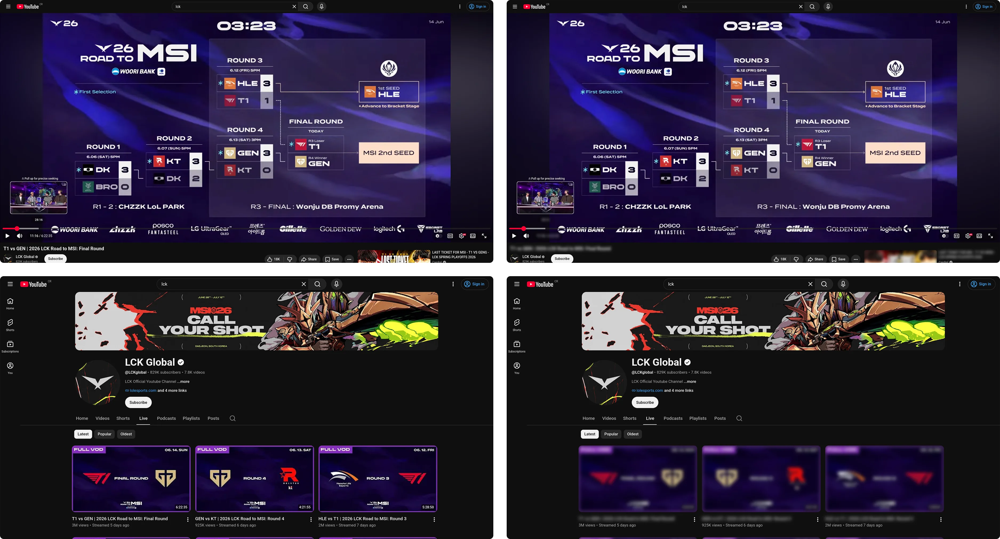

<h3 align="center">
	<br/>
	Ward
</h3>

<p align="center">
	Vision denied. Spoilers concealed.
</p>

<div align="center">
	
  
</div>

<p align="center">
	
</p>

## About

Ward is a lightweight Firefox extension that protects you from YouTube spoilers by blurring
video titles, thumbnails, comments, timestamps, and chapters across the site. You stay in
control — adjust blur intensity and toggle what gets blurred from the popup.

## Features

Ward can independently blur each of the following elements on YouTube:

| Target         | What gets blurred                                                   |
| -------------- | ------------------------------------------------------------------- |
| **Titles**     | Video titles in recommendations, search results, and the watch page |
| **Thumbnails** | Video thumbnails in recommendations, playlists, and end screens     |
| **Comments**   | The comment section to prevent spoilers from other viewers          |
| **Timestamps** | Timestamps and progress indicators in the player and description    |
| **Chapters**   | Chapter markers and section dividers in the video player            |

Adjust the blur strength (1–20 px) from the popup — or turn Ward off entirely with a single toggle.

## Installation

### Marketplace

Install from [Firefox Add-ons](https://addons.mozilla.org/en-US/firefox/addon/ward-spoiler-blocker/).

### Manual

Download the latest `ward-firefox_<version>.zip` from the
[releases page](https://github.com/dahrte/ward/releases/latest).

<details>
  <summary>Firefox</summary>

1. Open the Add-ons page by navigating to `about:addons`.
2. Click the cog/settings icon in line with the "Manage Your Extensions" heading and select **Debug Add-ons**.
3. Click the **Load Temporary Add-on...** button and select the downloaded `.zip` file.
</details>

### From source

> [!NOTE]
> This project uses **Vite+** — the unified toolchain that manages your runtime, package
> manager, and frontend tooling (Vite, Oxlint, Oxfmt, Rolldown, and more) in one place.
> If you don't have it yet:
> ```sh
> curl -fsSL https://vite.plus | bash
> ```

```sh
vp install        # install dependencies
vp dev            # start dev server (hot reload)
vp build          # production build
vp zip            # package extension as .zip
```

The built extension will be in `.output/`.

## How it works

Ward's content script runs at `document_start` on every YouTube page. It injects a `<style>`
element containing CSS selectors for each blur target — the same rules that get toggled on
and off via `data-ward-*` attributes on `<html>`. The popup communicates through WXT storage,
so all settings persist across tabs and sessions.

**No network requests, no analytics, no unnecessary permissions.** Just a single `storage`
permission and a handful of CSS rules.

## License

Distributed under the MIT License. See [LICENSE](./LICENSE) for more information.
